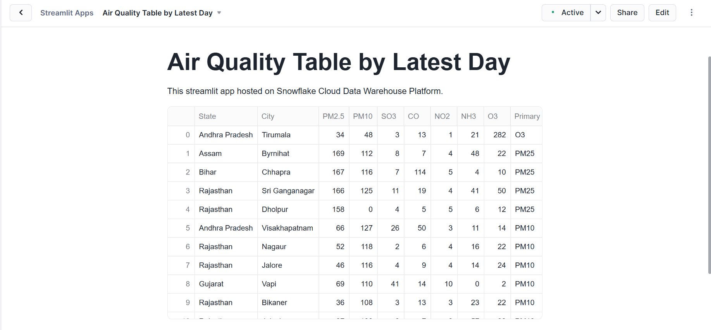
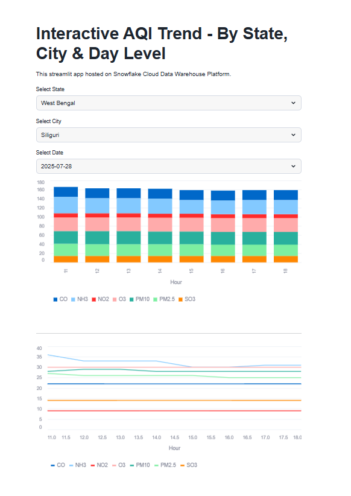
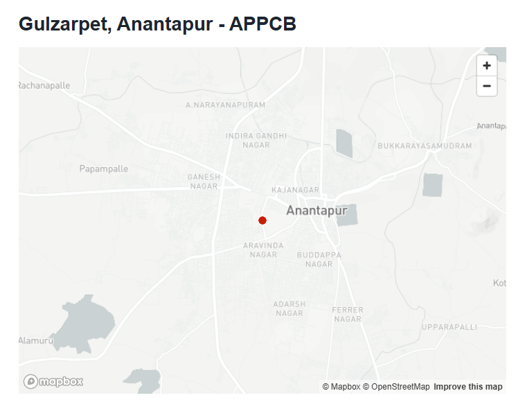

# Snowflake based AQI Pipeline

<b>Context:</b> We are getting Real-time Air Quality Index (AQI) Data from the API on an hourly basis. So, AQI means, its a standardized system used to measure and report air quality in a specific area. And It can range from 0 to 500.

It can be like:
- 0–50: Good
- 51–100: Moderate
- 101–150: Unhealthy for sensitive groups (e.g., children, elderly)
- 151–200: Unhealthy
- 201–300: Very Unhealthy
- 301–500: Hazardous

And common pollutants that are measured are like:
- PM2.5 (fine particulate matter)
- PM10 (larger particulate matter)
- O₃ (ozone)
- NO₂ (nitrogen dioxide)
- SO₂ (sulfur dioxide)
- CO (carbon monoxide)

Governments and environmental agencies (like India's CPCB) use the AQI to issue warnings, enforce regulations, and inform the public about air pollution and health risks.

<b>Services & Tools used: </b>
- API
- Python
- SQL
- Snowflake DataWarehouse
  - a. Database
  - b. Schema
  - c. Stage
  - d. Standard Table
  - e. Dynamic Tables
  - f. User-Defined Functions
- Snowpark
  - a. Python Script
- Streamlit
- GitHub Action

<b><i>High Level Architecture:- </i></b>

</img>

<b><i>Snowflake Pipeline:- </i></b>

</img>

<b>Project Description:- </b> 
- So, I have a Snowpark Script, that will call the API & get the response from it. After getting the response, it will save its json data into one file and that file will be uploaded to the Snowflake Stage.

- Now, to automate this process, I have setup a GitHub Action Workflow that will run a Job every 45th minute of the hour (meaning approx. every hour) that will call this Snowpark Script every hour to populate the data into Snowflake Stage.

- Afterthat, I have created a one Snowflake Task, that will copy the data from the file that is on Snowflake Stage to Snowflake Table.

- Afterthat, I have created a Dynamic Table that will handle any duplicacy in the data and as well as after removing any duplicate data, it will flatten that Raw Table.

- Afterthat, I have created one more Dynamic Table that will flatten more, from the previous Dynamic Table and it will transpose it from rows to columns. Also, it will convert any NA or null values to 0.

- Then, I have created two dimension dynamic tables: date dimension table & location dimesnion table. In date dimension table, I have all unique date dimesnions like time, year, month, day, quarter, hour and date_id. Similarly, In location dimension table, I have all unique locations and it includes columns like latitude, longitude, country, state, city, station & location_id.

- And afterthat, I have created one fact dynamic table: air_quality_fact table that will have all pollutants quantity information, and which pollutant is higher and its highest value, and with the date_id & location_id as the Foreign Key.

- Then afterwards, from that one fact table & two dimesnion tables, I am creating one another dynamic table that will have hourly data for each state with its city.

- And then at lastly, I have one dynamic table that will have particular day level data from the previously created hourly based dynamic table.

- And I have created total 3 dashboards. One is displaying latest day data for every state with its city. Second dashboard is displaying hourly data for a selected date & it is displaying in the form of Bar Chart & Line Chart. And the Third dashboard is displaying the data at the Station level for every city and for every state and for a particular date. And it is also showing the location into the map of that particular station.

<b><i>Streamlit Dashboards:- </i></b>

</img>

</img>

</img>

<b>❤️ Found this project useful?</b>

If you found this project useful, then please consider giving it a "⭐" on GitHub and sharing it with your friends via social media.

